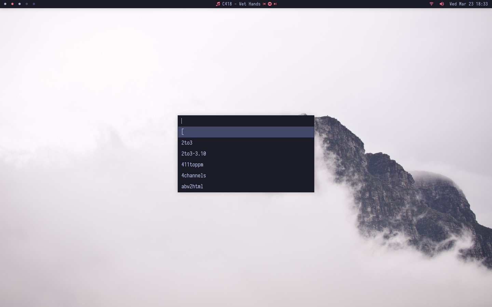

# dmenu - dynamic menu


> dmenu is an efficient dynamic menu for X.

## Content
* [Dependencies](#dependencies)
* [Installation](#installation)
* [Running dmenu](#running-dmenu)
* [Patches](#patches)

## Dependencies

In order to build dmenu you need the Xlib header files.
Also, for colored emoji support you'll need:
- `Iosevka Nerd Font` is the default font. It can be changed in `config.def.h` or using the `-fn` flag.
- [`libxft-bgra`](https://aur.archlinux.org/packages/libxft-bgra-git/) to render color emojis.
- `Noto Color Emoji` or `JoyPixels` for emojis.

## Installation

```
$ git clone https://github.com/lr-tech/dmenu.git
$ cd dmenu
$ sudo make clean install && make clean
```

## Running dmenu

See the man page for details.

## Patches

Some patches have been applied in order to accomplish a better experience:

| Patch             | Version           |
|-------------------|-------------------|
| Allow Color Font  | 5.0               |
| Border            | 20201112-1a13d04  |
| Case Insensitive  | 5.0               |
| Center            | 20200111-8cd37e1  |
| Line Height       | 5.0               |
| Topbar            | d78ff08           |
